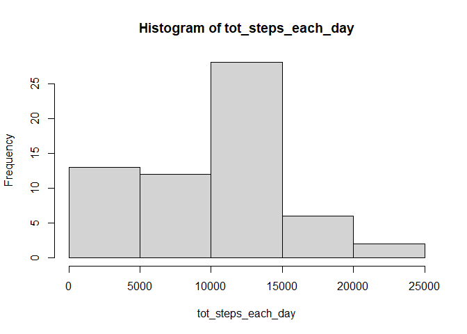
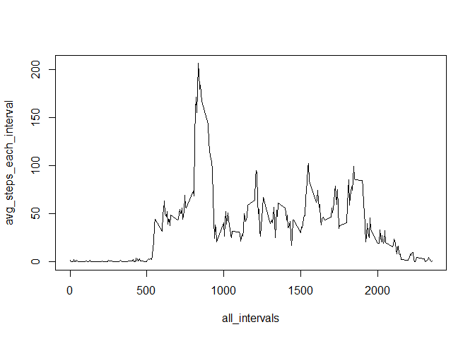
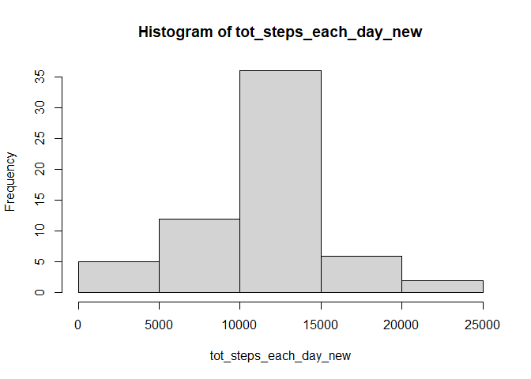
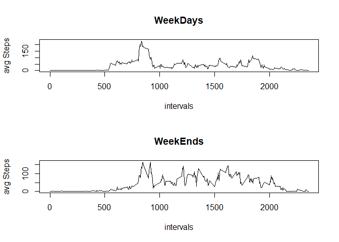

## Loading and preprocessing the data

```r
data <- read.csv("./activity/activity.csv")
data$date <- as.Date(data$date)
head(data)
```

```
##   steps       date interval
## 1    NA 2012-10-01        0
## 2    NA 2012-10-01        5
## 3    NA 2012-10-01       10
## 4    NA 2012-10-01       15
## 5    NA 2012-10-01       20
## 6    NA 2012-10-01       25
```


## What is mean total number of steps taken per day?


```r
# total steps on each day
tot_steps_each_day <- with(data,tapply(steps, date, sum,na.rm=TRUE))
all_dates <- unique(data$date)

#ploting and median
hist(tot_steps_each_day)
```

<!-- -->

```r
cat("meadian  - ",median(tot_steps_each_day),"\n")
```

```
## meadian  -  10395
```

```r
cat("mean  - ",mean(tot_steps_each_day),"\n")
```

```
## mean  -  9354.23
```
median of total steps each day is *10395*
and mean of total steps each day  is *9354.23*


## What is the average daily activity pattern?


```r
avg_steps_each_interval <- with(data,tapply(steps, interval, mean,na.rm=TRUE))
all_intervals <- unique(data$interval)

plot(all_intervals,avg_steps_each_interval,type="l")
```

<!-- -->

```r
names(avg_steps_each_interval)[which.max(avg_steps_each_interval)]
```

```
## [1] "835"
```
5 min Interval at which max avg steps is recorded is *835-840*

## Imputing missing values

Strategy - All the NA values are replaced by the average number of steps taken in particular interval 


```r
table(is.na(data$steps))
```

```
## 
## FALSE  TRUE 
## 15264  2304
```
No of NA's = 2304


```r
#replacing NA with mean of respective intervals
data_new <- data
data_new$steps[is.na(data_new$steps)] <- avg_steps_each_interval[as.character(data_new$interval[is.na(data_new$steps)])]
head(data_new)
```

```
##       steps       date interval
## 1 1.7169811 2012-10-01        0
## 2 0.3396226 2012-10-01        5
## 3 0.1320755 2012-10-01       10
## 4 0.1509434 2012-10-01       15
## 5 0.0754717 2012-10-01       20
## 6 2.0943396 2012-10-01       25
```

```r
tot_steps_each_day_new <- with(data_new,tapply(steps, date, sum,na.rm=TRUE))
cat("new meadian  - ",median(tot_steps_each_day_new),"\n")
```

```
## new meadian  -  10766.19
```

```r
cat("new mean  - ",mean(tot_steps_each_day_new),"\n\n")
```

```
## new mean  -  10766.19
```

```r
cat("old meadian  - ",median(tot_steps_each_day),"\n")
```

```
## old meadian  -  10395
```

```r
cat("old mean  - ",mean(tot_steps_each_day),"\n")
```

```
## old mean  -  9354.23
```

```r
#plotting histogram
hist(tot_steps_each_day_new)
```

<!-- -->


## Are there differences in activity patterns between weekdays and weekends?


```r
assign_fun <- function(x){
  if(x=="Saturday" | x=="Sunday")return("Weekend");
  return("Weekday")
}
data_new$week <-  sapply(weekdays(data_new$date),assign_fun)
head(data_new)
```

```
##       steps       date interval    week
## 1 1.7169811 2012-10-01        0 Weekday
## 2 0.3396226 2012-10-01        5 Weekday
## 3 0.1320755 2012-10-01       10 Weekday
## 4 0.1509434 2012-10-01       15 Weekday
## 5 0.0754717 2012-10-01       20 Weekday
## 6 2.0943396 2012-10-01       25 Weekday
```


```r
data_split_weekdays <- split(data_new,data_new$week)
```

```r
data_split_weekdays$Weekday <- with(data_split_weekdays$Weekday,tapply(steps, interval, mean,na.rm=TRUE))
data_split_weekdays$Weekend <-  with(data_split_weekdays$Weekend,tapply(steps, interval, mean,na.rm=TRUE))
par(mfrow = c(2,1))
plot(all_intervals,data_split_weekdays$Weekday,xlab = "intervals",ylab = "avg Steps",main = "WeekDays",type = 'l')
plot(all_intervals,data_split_weekdays$Weekend,xlab = "intervals",ylab = "avg Steps",main = "WeekEnds",type='l')
```

<!-- -->

